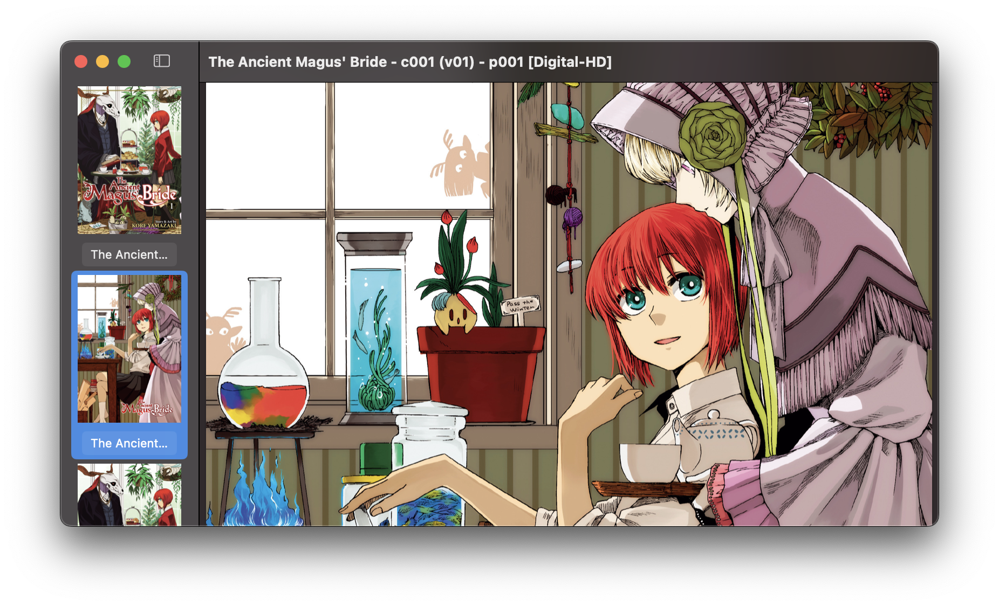

# Sequential

A macOS app for viewing a collection of images.

## Rationale

The Preview app built-in to macOS is probably one of the operating system's most useful features. The app's capability of opening images and documents in a compact form with many options allows users to largely not require third-party apps, as well as not care about Preview itself.

As Preview is an app that supports both reading and basic editing, it adopts a large scope and has to constrain itself on the features it directly supports. As a concrete example, when viewing PDFs, pages derive their frame size from their internal representation (e.g. the width and height of an image), resulting in pages of differing sizes. This may be desirable when using Preview, since it targets general-purpose documents (e.g. a PDF you have to read and sign, with a page you may want to rotate); but for more focused scopes (e.g. an image collection viewer), Preview starts to show its limitations.

From my own personal experience, prior to developing Sequential, I had been using [a shortcut I wrote to convert a set of images into a single PDF with their sizes scaled to fit horizontally][shortcut]. It worked half the time, but came with many issues:
- **Conversion had to take place before opening.** Similar to the built-in "Create PDF" shortcut, the conversion had to finish before the PDF would be created. For small sizes, this isn't much of an issue; but for larger ones (e.g. 250MB+), the time in reading, scaling, and creating produces a long, dreaded delay.
- **Pages were often incorrectly scaled.** While the image width and height did match, the page size often did not.
- **Converting required significant CPU and memory usage.** It was common to see "BackgroundShortcutRunner" using 600% CPU in Activity Monitor, and because Shortcuts creates the PDF in-memory, a large-enough input could result in crippling memory consumption.
- **Scaling, in general, was often poor.** There were a number of times where I took a produced PDF and sent it to my phone, only to notice white lines that appeared on the border that would fade as I zoomed in.
- **The file size was much larger.** Since many images had to be artificially upsized, the resulting PDF often had a significantly larger file size compared to the input. For example, I have a local copy of the manga "Children of the Whales", weighting in at ~300 MB. When converted to a scaled PDF, however, its size balloons to ~1 GB.

Sequential was created to provide an experience as simple as (or even simpler than) Preview, while also solving many of the outlined issues above. At the same time, however, it is not Sequential's goal to replace Preview (e.g. by replicating its basic editing capabilities) since Sequential's domain is scoped to image viewing. A core issue Sequential addresses, for example, is Preview's lack of support for continuously scrolling a set of images.

## Features

- Simple interface: A main canvas for viewing images, and a sidebar for managing them
- Continuous scrolling
- Support for Live Text
- Configurable margins
- Fast:
  - Only loads what is required up front, reducing initialization dramatically[^1]
  - Performs downsampling on images to match the size on-screen, improving CPU and memory usage while not compromising image quality.[^2] You can drop hundreds of 4K+ images, and Sequential won't complain

## Screenshot

  
An example using the first volume of the manga "The Ancient Magus' Bride"

  
  

[^1]: A local copy of the first volume of the manga [The Ancient Magus' Bride][the-ancient-magus-bride] (~350 MB) loads in a little under 2 seconds on my 2019 MacBook Pro. To compare, Preview loads the same set of images in 7 seconds, and continues to heavily utilize the CPU in the background for much longer.
[^2]: Downsampling involves processing an image to create a representation at a lower resolution. For Sequential, it's important to support displaying many images at many different sizes without sacrificing image quality. Before an image appears on-screen, it is downsampled at the size of the frame it's given with respect to how many pixels can fit in the frame. The result is that, at smaller frame sizes (e.g. in the sidebar), images appear roughly how they would at larger frame sizes (e.g. in the main canvas) while not introducing effects like high pixelation. 
[shortcut]: https://kyleerhabor.com/convert-images-to-same-width-pdf.shortcut
[the-ancient-magus-bride]: https://en.wikipedia.org/wiki/The_Ancient_Magus%27_Bride
